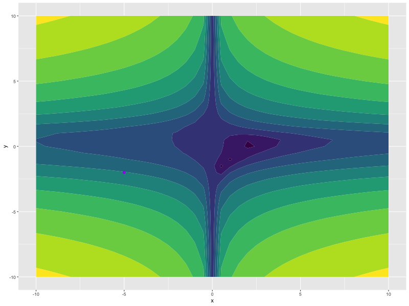

<!-- README.md is generated from README.Rmd. Please edit that file -->

# madgrad

<!-- badges: start -->
<!-- badges: end -->

The Madgrad package is an R port of the original
[madgrad](https://github.com/facebookresearch/madgrad). See the [Arxiv
paper](https://arxiv.org/abs/2101.11075) for details on the method.

## Installation

Madgrad is not yet on CRAN. The development version from
[GitHub](https://github.com/) can be installed with:

``` r
# install.packages("devtools")
devtools::install_github("mlverse/madgrad")
```

## Example

This is a small example showing how to use `madgrad` with torch to
minimize a function, of course, `madgrad` is not the best algorithm for
this task and should work better for neural network training.

``` r
library(madgrad)
library(torch)

torch_manual_seed(1)

f <- function(x, y) {
  log((1.5 - x + x*y)^2 + (2.25 - x - x*(y^2))^2 + (2.625 - x + x*(y^3))^2)
}

x <- torch_tensor(-5, requires_grad = TRUE)
y <- torch_tensor(-2, requires_grad = TRUE)

opt <- optim_madgrad(params = list(x, y), lr = 0.1)

for (i in 1:100) {
  opt$zero_grad()
  z <- f(x, y)
  z$backward()
  opt$step()
}
x
#> torch_tensor
#>  2.2882
#> [ CPUFloatType{1} ]
y
#> torch_tensor
#>  0.2412
#> [ CPUFloatType{1} ]
```


