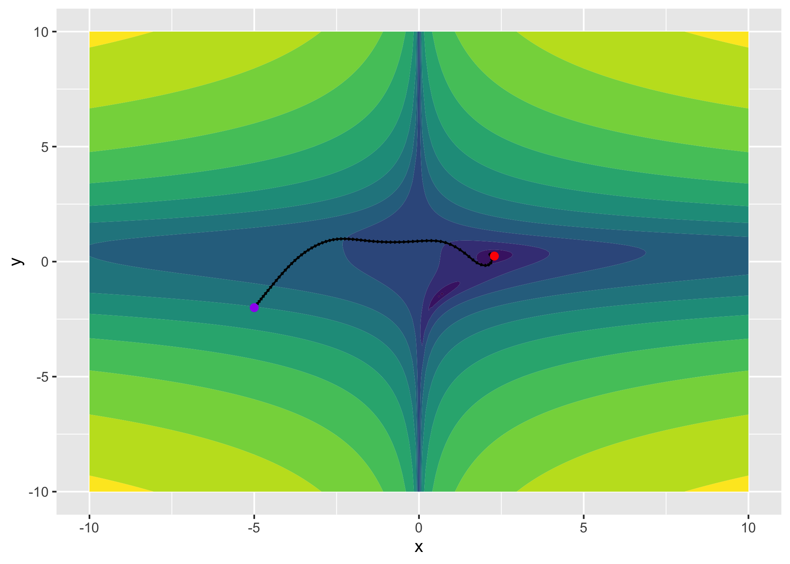

<!-- README.md is generated from README.Rmd. Please edit that file -->

# madgrad

<!-- badges: start -->
<!-- badges: end -->

The Madgrad package is an R port of the original
[madgrad](https://github.com/facebookresearch/madgrad). See the [Arxiv
paper](https://arxiv.org/abs/2101.11075) for details on the method.

## Installation

Madgrad is not yet on CRAN. The development version from
[GitHub](https://github.com/) can be installed with:

``` r
# install.packages("devtools")
devtools::install_github("mlverse/madgrad")
```

## Example

This is a small example showing how to use `madgrad` with torch to
minimize a function, of course, `madgrad` is not the best algorithm for
this task and should work better for neural network training.

``` r
library(madgrad)
library(torch)
library(ggplot2)
torch_manual_seed(1)

f <- function(x, y) {
  log((1.5 - x + x*y)^2 + (2.25 - x - x*(y^2))^2 + (2.625 - x + x*(y^3))^2)
}

grid <- expand.grid(x = seq(-10, 10, by = 0.1), y = seq(-10, 10, by = 0.1))
grid$z <- f(grid$x, grid$y)
g <- ggplot(grid) +
  geom_contour_filled(aes(x = x, y = y, z = z))
```

``` r
x <- torch_tensor(-5, requires_grad = TRUE)
y <- torch_tensor(-2, requires_grad = TRUE)

opt <- optim_madgrad(params = list(x, y), lr = 0.1)
values <- list(list(x$item(), y$item()))
for (i in 1:100) {
  opt$zero_grad()
  z <- f(x, y)
  z$backward()
  opt$step()
  values[[length(values) + 1]] <- list(x$item(), y$item())  
}

paths <- values %>% 
  purrr::map_dfr(~tibble::tibble(x = .x[[1]], y = .x[[2]])) %>% 
  dplyr::mutate(xend = dplyr::lead(x), yend = dplyr::lead(y))
  
g + 
  geom_segment(data = paths, aes(x = x, y  = y, xend = xend, yend = yend), 
               arrow = arrow(length = unit(0.02, "inches"))) +
  geom_point(data = tail(paths, 1), aes(x = x, y= y), color = "red", size = 2) +
  geom_point(data = head(paths, 1), aes(x = x, y= y), color = "purple", size = 2) +
  theme(legend.position = "none")
#> Warning: Removed 1 rows containing missing values (geom_segment).
```


